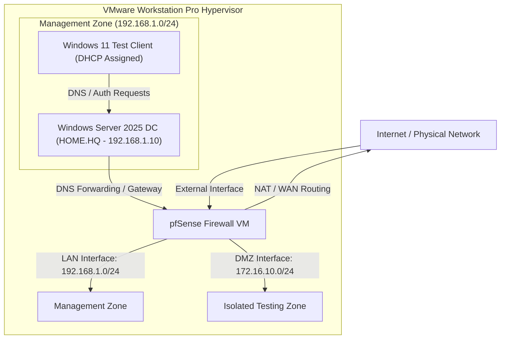

# Network Topology & Infrastructure Architecture

This document maps out the logical and physical network layout of the enterprise homelab environment.

## 📊 Logical Architecture Diagram

```mermaid
graph TD
    %% Internet Edge
    WAN["Internet / Physical Network"] -->|External Interface| PF[pfSense Firewall VM]
    
    %% Firewall Routing
    subgraph VM ["VMware Workstation Pro Hypervisor"]
        PF -->|"LAN Interface: 192.168.1.0/24"| MGMT[Management Zone]
        PF -->|"DMZ Interface: 172.16.10.0/24"| DMZ[Isolated Testing Zone]
        
        %% Internal Services
        subgraph MZ ["Management Zone (192.168.1.0/24)"]
            DC1["Windows Server 2025 DC (HOME.HQ - 192.168.1.10)"]
            Client1["Windows 11 Test Client (DHCP Assigned)"]
        end
    end

    %% Protocol Flow
    Client1 -->|DNS / Auth Requests| DC1
    DC1 -->|DNS Forwarding / Gateway| PF
    PF -->|NAT / WAN Routing| WAN
```
